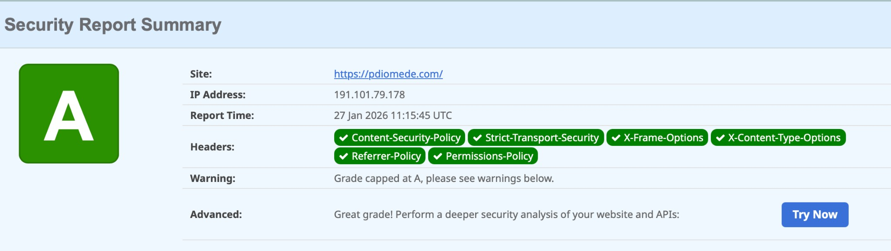

# Paolo Diomede - Personal Portfolio Website

> Professional portfolio showcasing web3 governance expertise, ecosystem building, and community leadership.

[](https://www.w3.org/html/)
[](https://www.w3.org/Style/CSS/)
[](https://developer.mozilla.org/en-US/docs/Web/JavaScript)

🔗 **Live Site**: [pdiomede.com](https://pdiomede.com)

---

## 📋 About

Personal portfolio highlighting work in:
- **Business Development** - Technical Account Manager at [Certora](https://www.certora.com)
- **Ecosystem Building** - Advisory Board Member at [Livepeer](https://livepeer.org)
- **Community Leadership** - Former Ecosystem Manager at [The Graph Foundation](https://thegraph.com) (2022-2025), Founder of [Graphtronauts](https://graphtronauts.app) and [Live Pioneers](https://livepioneers.app)
- **Innovation** - Creator of [IndexerScore.com](https://indexerscore.com) and [GraphTools.pro](https://graphtools.pro)

---

## ✨ Features

- ⚡ **Performance** - Optimized loading, lazy images, Core Web Vitals optimized
- ♿ **Accessibility** - WCAG 2.1 AAA compliant, keyboard navigation, ARIA labels
- 🔍 **SEO** - Complete meta tags, Schema.org structured data, Open Graph
- 🔒 **Security** - Content Security Policy, SRI, secure headers
- 🌗 **Dark Mode** - System preference detection with manual toggle
- 📱 **Responsive** - Mobile-first design, works on all devices
- 🎨 **Design Variants** - Elegant Frame (default) and Material Design styles

---

## 🚀 Quick Start

1. **Clone the repository**:
```bash
git clone https://github.com/pdiomede/pdiomede.com.git
cd pdiomede.com
```

2. **Open in browser**:
   - Open `index.html` directly, or
   - Use a local server: `python3 -m http.server 8000` then visit `http://localhost:8000`

---

## 🎨 Design Variants

- **Elegant Frame** (`index.html`) - Default design with clean borders and subtle gradients
- **Material Design** (`index-material.html`) - Material Design elevation, ripple effects, Roboto typography

Both variants support dark mode and are fully responsive.

---

## 📁 Project Structure

```
myWeb/
├── index.html              # Main HTML (Elegant Frame)
├── index-material.html     # Material Design variant
├── .htaccess               # Apache server configuration (security headers, performance)
├── README.md               # This file
├── CHANGELOG.md            # Version history
├── LICENSE.md              # MIT License
├── manifest.json           # PWA manifest
└── images/                 # Images and icons
```

---

## 🔧 Customization

- **Content**: Edit meta tags and Schema.org data in `<head>`
- **Images**: Replace files in `./images/` directory
- **Theme**: Modify CSS custom properties in `:root` and `[data-theme="dark"]`
- **Links**: Update social links in header and footer sections

---

## 🚀 Deployment

### Server Configuration

The project includes a `.htaccess` file for Apache servers (e.g., Hostinger) that configures:

**Security Headers:**
- Content Security Policy (CSP)
- Strict-Transport-Security (HSTS) - uncomment after SSL verification
- X-Frame-Options (clickjacking protection)
- X-Content-Type-Options (MIME-type sniffing protection)
- Referrer-Policy
- Permissions-Policy

**Performance Optimizations:**
- Gzip compression for text files
- Browser caching (1 year for images/fonts, 1 month for CSS/JS)

**Security Settings:**
- Disabled directory browsing
- Protected sensitive files

### Upload Instructions

1. **Upload `.htaccess`** to your server's `public_html` directory (same location as `index.html`)
2. **Verify** `mod_headers` is enabled on your Apache server (contact hosting support if needed)
3. **Test** security headers at [SecurityHeaders.com](https://securityheaders.com/?q=https://pdiomede.com)

**Note**: The `.htaccess` file is safe to commit to GitHub as it contains no sensitive credentials.

---

## 📊 Performance

**GTmetrix Grade: A**
- Performance: 94%
- Structure: 98%

**Core Web Vitals:**
- LCP (Largest Contentful Paint): 1.4s
- TBT (Total Blocking Time): 2ms
- CLS (Cumulative Layout Shift): 0

**Lighthouse Score:** 95+ across all categories

---

## 🔒 Security

**SecurityHeaders.com Grade: A**



**Security Headers Status:**
- ✅ Content-Security-Policy (CSP with SHA256 script hashes - no unsafe-inline)
- ✅ Strict-Transport-Security (HSTS)
- ✅ X-Frame-Options
- ✅ X-Content-Type-Options
- ✅ Referrer-Policy
- ✅ Permissions-Policy

**CSP Security Features:**
- **No `unsafe-inline` in script-src**: Uses SHA256 hashes for inline scripts instead
- Stronger XSS protection by only allowing specific whitelisted inline scripts
- Subresource Integrity (SRI) on external resources

**Test Results:** [View full report](https://securityheaders.com/?q=https://pdiomede.com)

All critical HTTP security headers are properly configured via `.htaccess` file, ensuring protection against common web vulnerabilities including clickjacking, MIME-type sniffing, and XSS attacks.

---

## 🛠️ Tech Stack

- HTML5 (semantic markup, ARIA)
- CSS3 (Grid, Flexbox, Custom Properties)
- Vanilla JavaScript (minimal, theme toggle only)
- Google Fonts (Geist, Inter)
- Font Awesome 6.4.0 (with SRI)
- Apache `.htaccess` (security headers, compression, caching)

---

## 📄 License

**Code**: MIT License - See [LICENSE.md](./LICENSE.md)

**Content**: All personal content (biography, images, branding) is protected and reserved. You may use the code structure as reference, but please do not copy personal content or present this work as your own.

---

## 📧 Contact

- **Email**: pdiomede@yahoo.com
- **LinkedIn**: [linkedin.com/in/pdiomede](https://linkedin.com/in/pdiomede/)
- **Twitter/X**: [@pdiomede](https://x.com/pdiomede)
- **Farcaster**: [farcaster.xyz/pdiomede](https://farcaster.xyz/pdiomede)
- **GitHub**: [github.com/pdiomede](https://github.com/pdiomede)

---

**Built with ❤️ by Paolo Diomede**

For detailed version history and technical documentation, see [CHANGELOG.md](./CHANGELOG.md).
